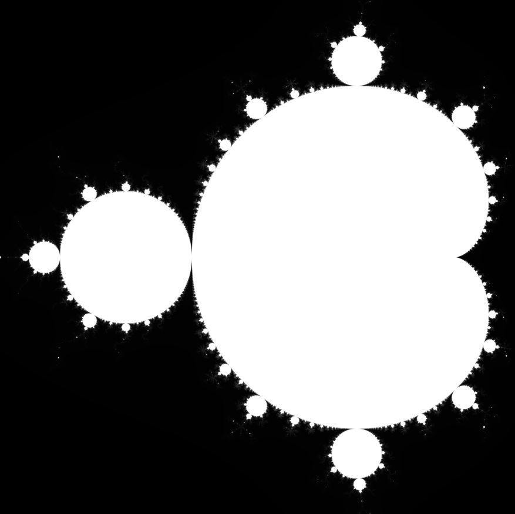
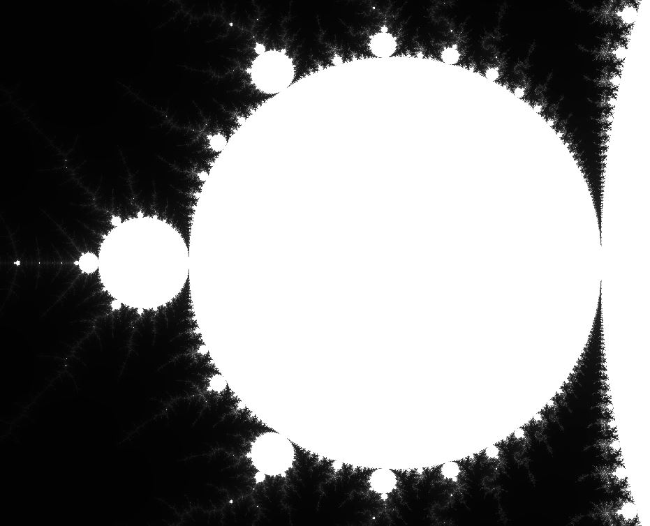

# Mandelbrot Generator

This program makes use of a client-server model to generate a portable greymap (PGM) image of the [Mandelbrot set](https://en.wikipedia.org/wiki/Mandelbrot_set). The client distributes the workload to a given list of servers, where each server calculates a sub-image of pixels that are later integrated by the client.

## Server

The server is implemented in javascript, or specifically [Node](https://nodejs.org/en/), using the express module. By default it listens to localhost:3000, but can easily be set up to listen to a user defined ip-address and port. The only request it will respond to is given in the format:
```js
GET /mandelbrot/x_min/y_min/x_max/y_max/x_num/y_num/n_lim
```
where [x_min,x_max] & [y_min,y_max] are the x- & y-ranges of the real and imaginary part respectively that are to be calculated, x_num * y_num designate the dimensions of the sub-image, and n_lim denote the maximun number of iterations used to calculate the bound of each pixel.

## Client

The client is written in python (v3.6.9), and it takes a set of parameters as input arguments:

```bash
x_min y_min x_max y_max max_n x y dim list-of-servers
```

where [x_min, x_max] & [y_min, y_max] are the full x- & y-ranges on the complex plane that will span the PGM image, max_n is the maximum number of iterations for the Mandelbrot calculations, x & y are the dimensions of the full image, dim * dim is the dimensions of each sub-image, and list-of-servers is a space separated list of servers that are to be queried.

The client then loops over the whole grid and builds urls to request the evaluated pixels from each server, in sets of dim * dim sub-images. Assuming N servers, each loop iteration will yield N sub-images that are then integrated into the full image. After all pixels have been calculated, the image is generated and stored in the images folder.

## Usage

The quickest way to run the program with default values, but slowest execution time, is to simply run these two commands from the root folder in one terminal each:

```bash
$ node server/app.js

$ python client/main.py
```

This will generate a timestamped 600x600 PGM image and save it in the images folder, e.g. "images/mandelbrot_600x600_13-10-22_1046.pgm".

To set up three servers, e.g. localhost:3333, localhost:4444, & 172.25.142.37:2222, simply run these commands in a terminal each:

```bash
$ node server/app.js 4444
$ node server/app.js 3333
$ node server/app.js 172.25.142.37 2222
```

Then, in another terminal:

```bash
$ python client/main.py -1.5 -1 0.5 1 1024 10000 10000 4 localhost:4444 localhost:3333 172.25.142.37:2222
```

This will generate a 10000x10000 PGM image between x = [-1.5, 0.5] and y = [-1, 1] on the complex plane.

## Example images

The first image below is generated by the example command above. The second image is a cropped image of the first one, with a zoom of more than 1000%.




